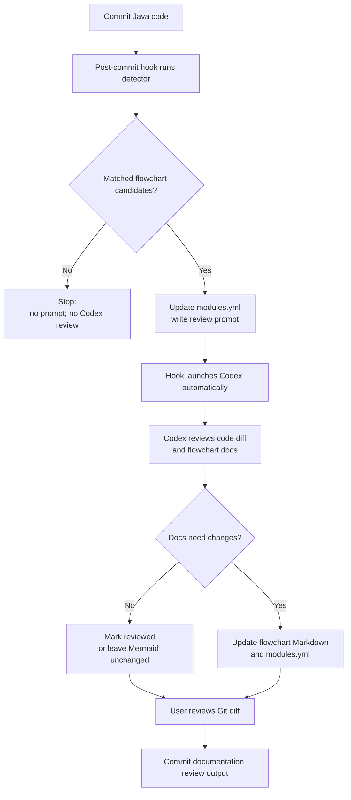

# Flowchart Review Automation

This guide explains how to use AI-assisted SimPaths flowchart review. The user-friendly default is fully automatic AI review after relevant code commits. The more controlled alternative is on-demand review, where you decide when Codex should spend time and tokens reviewing accumulated commits.

## 1. Recommended Workflow: Fully Automatic AI Review

Use this workflow if you want the simplest setup:

```text
install once -> commit Java code -> Codex reviews relevant commits -> review and commit documentation changes
```

Fully automatic mode is easiest to understand because you commit normally. If a commit touches code linked to existing flowcharts, the hook prepares the review prompt and launches Codex automatically.

### 1.1 Whole Process



### 1.2 What Runs Automatically

The fully automatic hook runs after each local commit and calls:

```powershell
Invoke-FlowchartReviewAgent.ps1 -Rev HEAD -BypassCodexSandbox -Quiet
```

If no flowchart candidates are detected, Codex is not launched. If candidates are detected, Codex reviews the latest commit and may update:

```text
documentation/flowcharts/modules.yml
documentation/flowcharts/modules/*.md
```

### 1.3 Why On-Demand Review Still Exists

Fully automatic mode can spend tokens and time on commits that touch broad shared files such as `Person.java` or `SimPathsModel.java`, even when the final conclusion is that no flowchart update is needed.

Use on-demand review instead when you want to:

- save tokens during experimental work;
- avoid documentation edits after every intermediate commit;
- batch several commits into one flowchart review;
- decide explicitly when flowchart documentation matters for the current task.

The on-demand workflow is documented in section 6.

## 2. Before You Install

These steps are for users who are not familiar with PowerShell or terminal commands.

### 2.1 Open a PowerShell Terminal

Open one of these:

- Windows Terminal;
- PowerShell from the Start menu;
- the terminal inside IntelliJ IDEA or VS Code.

You do not need to start in the repository folder because the commands below use full paths.

### 2.2 Check Python

Run:

```powershell
D:\python\python.exe --version
```

If this prints a Python version number, the detection and prompt-generation scripts can run. We use Python version 3.11.0. If Python is installed somewhere else, either add `python` to your system `PATH` or update the PowerShell wrappers to use your Python path. The current wrappers try `D:\python\python.exe` first and then fall back to `python`.

### 2.3 Check Codex CLI

Run:

```powershell
codex --version
```

If this prints a version number, Codex CLI is available from PowerShell. If PowerShell says `codex` is not recognized, install or repair Codex CLI before using AI review automation. Candidate detection can still run without Codex CLI, but fully automatic or on-demand AI review cannot.

### 2.4 Log in to Codex CLI

Run:

```powershell
codex login
```

Follow the browser or terminal login instructions. This only needs to be done once per machine unless credentials expire.

### 2.5 Check The Repository Path

This guide assumes the repository is here:

```text
D:\CeMPA\SimPaths
```

If your clone is elsewhere, replace `D:\CeMPA\SimPaths` in the commands with your clone path.

### 2.6 Choose a Git Review Tool

GitHub Desktop is not required, but it is a beginner-friendly way to review and commit the documentation changes produced by the automation.

You can use any of these:

- GitHub Desktop;
- IntelliJ IDEA Git tools;
- VS Code Source Control;
- PowerShell with `git status` and `git diff`.

### 2.7 Commit the Automation Scripts First

Before installing the hook, commit the current automation script and documentation changes. The hook runs scripts from the working tree, so using a committed version makes later behavior easier to reproduce.

## 3. Install Fully Automatic AI Review

Install the fully automatic hook once per clone.

### 3.1 Install Fully Automatic Hook

```powershell
D:\CeMPA\SimPaths\.codex\skills\flowchart-update\scripts\Install-FlowchartReviewHook.ps1 -Mode Agent -BypassCodexSandbox -Quiet -Force
```

This recommended command includes `-Quiet`, so routine commits show only short status messages during the automatic AI review. The detailed Codex transcript is saved to `documentation/flowcharts/flowchart_review_agent.log`.

The installer writes:

```text
.git/hooks/post-commit
```

The hook is local to the current clone. If you clone the repository elsewhere, run the installer again from that clone. If you want to preview the hook command before installing, see section 7.6.

### 3.2 Uninstall Hook

```powershell
D:\CeMPA\SimPaths\.codex\skills\flowchart-update\scripts\Install-FlowchartReviewHook.ps1 -Uninstall
```

The uninstall command removes the flowchart automation hook only if it recognizes that the hook was created by this installer. It will not delete an unrelated custom `post-commit` hook.

## 4. After a Commit

After a relevant code commit, the hook may leave working-tree changes.

### 4.1 Expected Files

Possible outputs include:

```text
documentation/flowcharts/modules.yml
documentation/flowcharts/modules/*.md
documentation/flowcharts/flowchart_review_prompt.md
documentation/flowcharts/flowchart_review_agent.log
```

`modules.yml` and module Markdown files are tracked and should be reviewed before committing. `flowchart_review_prompt.md` and `flowchart_review_agent.log` are generated and ignored by Git.

If a commit has no matched code files or no matched flowchart modules, the hook prints a no-review-needed message and does not launch Codex.

### 4.2 Review And Commit Results

Use your normal Git diff view, for example GitHub Desktop, IntelliJ IDEA, VS Code, or:

```powershell
git diff documentation/flowcharts
```

Review the changed documentation files. If they are correct, commit the documentation review output separately from the original code commit.

## 5. Generated Prompt and Log

The prompt and log are generated handoff/debugging artifacts, not source documents.

### 5.1 Prompt Location

```text
documentation/flowcharts/flowchart_review_prompt.md
```

This file is ignored by Git. It is normal for a fresh checkout or branch not to have it.

### 5.2 Agent Log Location

```text
documentation/flowcharts/flowchart_review_agent.log
```

This log stores the detailed Codex output for the latest AI review run. It is ignored by Git.

The log is overwritten on each Codex review run. It contains the latest AI review transcript only.

### 5.3 Prompt Contents

The generated prompt includes:

- the committed code revision being reviewed;
- changed code files;
- priority module matches from `code_refs.methods`;
- broader file-level candidate modules from `code_refs.files`;
- manifest flagging results, when applicable;
- instructions for Codex to update flowcharts only when documented logic changed.

Priority modules should be reviewed first. File-level matches are candidates only and may be false positives when a shared file such as `Person.java` or `SimPathsModel.java` changes.

## 6. Advanced Cost-Control Workflow: On-Demand Codex Review

On-demand review is the controlled alternative to fully automatic review. In this workflow, commits still trigger candidate detection, but Codex runs only when you explicitly ask it to.

### 6.1 Enable On-Demand Review

If you currently have the fully automatic hook installed, uninstall it first:

```powershell
D:\CeMPA\SimPaths\.codex\skills\flowchart-update\scripts\Install-FlowchartReviewHook.ps1 -Uninstall
```

Then install the detection hook:

```powershell
D:\CeMPA\SimPaths\.codex\skills\flowchart-update\scripts\Install-FlowchartReviewHook.ps1 -Force
```

If you are setting up on-demand review from a fresh clone, run only the install command above. To preview the hook before installing it, run:

```powershell
D:\CeMPA\SimPaths\.codex\skills\flowchart-update\scripts\Install-FlowchartReviewHook.ps1 -DryRun
```

This hook runs:

```powershell
Prepare-FlowchartReview.ps1 -UpdateManifest
```

After this setup, future commits detect candidates and write a prompt, but they do not call Codex or update flowchart module Markdown files.

### 6.2 Run Codex Review When Wanted

When you decide the accumulated commits should be reviewed by Codex, run:

```powershell
D:\CeMPA\SimPaths\.codex\skills\flowchart-update\scripts\Invoke-FlowchartReviewAgent.ps1 -Rev OLD_COMMIT..HEAD -BypassCodexSandbox -Quiet
```

Replace `OLD_COMMIT` with the last commit that you consider already flowchart-reviewed. The command reviews all committed changes after `OLD_COMMIT` up to `HEAD` as one combined diff.

For a one-commit review:

```powershell
D:\CeMPA\SimPaths\.codex\skills\flowchart-update\scripts\Invoke-FlowchartReviewAgent.ps1 -Rev HEAD~1..HEAD -BypassCodexSandbox -Quiet
```

Running this command does not change future hook behavior. With the detection hook, later commits are detected and prompted, but Codex is not launched until you run the on-demand review command again.

### 6.3 Review Range Choice

Use `OLD_COMMIT..HEAD` when you want one review for all commits since the last flowchart-reviewed point.

Range reviews use the combined Git diff. If a change is made and later reverted inside the range, the final combined diff may not require a flowchart update.

## 7. Troubleshooting

### 7.1 No Prompt Was Generated

This usually means the commit had no changed code files matched by `documentation/flowcharts/modules.yml`.

### 7.2 Log Contains Only a Header

If `flowchart_review_agent.log` contains only the revision and command header, Codex did not complete the review. Re-run manually:

```powershell
D:\CeMPA\SimPaths\.codex\skills\flowchart-update\scripts\Invoke-FlowchartReviewAgent.ps1 -Rev HEAD~1..HEAD -BypassCodexSandbox -Quiet
```

### 7.3 Codex Sandbox Fails On Windows

If Codex reports `CreateProcessAsUserW failed: 5`, use:

```powershell
-BypassCodexSandbox
```

Use this mode only from the repository you intend Codex to edit, because it gives the Codex subprocess direct filesystem access.

### 7.4 Check The Hook Command

Inspect the installed hook:

```powershell
Get-Content D:\CeMPA\SimPaths\.git\hooks\post-commit
```

The fully automatic hook should call `Invoke-FlowchartReviewAgent.ps1 -Rev HEAD`. The on-demand detection hook should call `Prepare-FlowchartReview.ps1 -UpdateManifest`.

### 7.5 PowerShell Execution Policy Blocks a Script

If PowerShell refuses to run a script because execution is disabled, run the command through PowerShell with a one-time bypass:

```powershell
powershell.exe -NoProfile -ExecutionPolicy Bypass -File D:\CeMPA\SimPaths\.codex\skills\flowchart-update\scripts\Install-FlowchartReviewHook.ps1 -Mode Agent -BypassCodexSandbox -Quiet -DryRun
```

Use the same pattern for other `.ps1` scripts by replacing the path and arguments after `-File`.

### 7.6 Preview Hook Installation

If you want to check what hook would be installed before changing `.git/hooks/post-commit`, run:

For fully automatic AI review:

```powershell
D:\CeMPA\SimPaths\.codex\skills\flowchart-update\scripts\Install-FlowchartReviewHook.ps1 -Mode Agent -BypassCodexSandbox -Quiet -DryRun
```

For on-demand review:

```powershell
D:\CeMPA\SimPaths\.codex\skills\flowchart-update\scripts\Install-FlowchartReviewHook.ps1 -DryRun
```

This prints the hook path and command that would be installed, but does not change the hook file.
