# Labour Supply and Consumption Determination

## 1. Overview

This note traces how SimPaths determines labour supply and consumption in the current code. It covers the default annual labour-supply model, the optional intertemporal optimisation (IO) model, and the consumption rules that sit downstream of labour-market and income updates.

The main distinction is:

- with `enableIntertemporalOptimisations == false`, labour supply is a discrete random-utility choice over weekly-hours categories, and equivalised consumption is derived from disposable income and the model saving rate;
- with `enableIntertemporalOptimisations == true`, consumption and, when enabled, employment fractions are solved jointly in a forward-looking dynamic optimisation problem and then read from pre-computed grids during the simulation.

## 2. Purpose

This document answers two maintenance questions:

1. How is labour supply determined for benefit units in the annual simulation?
2. Is consumption determined jointly with labour supply, and is there intertemporal substitution between labour and consumption?

The short answer to the second question is: only in the IO branch. The default branch does not solve an intertemporal consumption-labour problem. In the IO branch, the value-function problem includes current consumption, current leisure, future expected value, saving/borrowing through liquid wealth, and optional employment controls.

## 3. Code References

- `src/main/java/simpaths/model/SimPathsModel.java`
  - `buildSchedule()`
  - `Processes.RationalOptimisation`
  - `Processes.LabourMarketAndIncomeUpdate`
  - `enableIntertemporalOptimisations`
- `src/main/java/simpaths/model/LabourMarket.java`
  - `update(int year)`
  - default branch with employment alignment and annual labour update
- `src/main/java/simpaths/model/BenefitUnit.java`
  - `BenefitUnit.Processes.UpdateStates`
  - `BenefitUnit.Processes.ProjectDiscretionaryConsumption`
  - `updateLabourChoices()`
  - `updateUtilityRegressionScoresWithoutFC()`
  - `updateFixedCostsAndLabour()`
  - `updateLabourSupplyAndIncome()`
  - `updateDiscretionaryConsumption()`
  - `setStates()`
- `src/main/java/simpaths/model/Person.java`
  - `Person.Processes.ProjectEquivConsumption`
  - `projectEquivConsumption()`
- `src/main/java/simpaths/model/enums/Labour.java`
  - discrete weekly-hours categories
  - `convertHoursToLabour(...)`
  - `getHours(Person person)`
- `src/main/java/simpaths/model/decisions/ManagerPopulateGrids.java`
  - reads or solves IO grids
- `src/main/java/simpaths/model/decisions/ManagerSolveGrids.java`
  - backward-induction loop over ages and state grids
- `src/main/java/simpaths/model/decisions/ManagerSolveState.java`
  - enumerates feasible employment controls for each state
- `src/main/java/simpaths/model/decisions/UtilityMaximisation.java`
  - continuous consumption optimisation for a fixed employment-control combination
- `src/main/java/simpaths/model/decisions/CESUtility.java`
  - current-period consumption/leisure CES utility and discounted expected value
- `src/main/java/simpaths/model/decisions/Expectations.java`
  - transforms employment controls into hours, income, tax-benefit outcomes, leisure, and next-period expectations
- `src/main/java/simpaths/model/decisions/Grids.java`
  - stores `consumption`, `employment1`, `employment2`, and `valueFunction` grid solutions

## 4. Schedule Context

In `SimPathsModel.buildSchedule()`:

1. `Processes.RationalOptimisation` is added to the first-year schedule only when `enableIntertemporalOptimisations` is true. It populates `Parameters.grids` through `ManagerPopulateGrids.run(...)`.
2. During each yearly schedule, `BenefitUnit.Processes.UpdateStates` is run before the labour-market update when IO is enabled. It builds a `States` object for grid interpolation.
3. `Processes.LabourMarketAndIncomeUpdate` calls `labourMarket.update(year)`.
4. After benefits status is assigned, `BenefitUnit.Processes.ProjectDiscretionaryConsumption` runs only when IO is enabled.
5. `Person.Processes.ProjectEquivConsumption` always runs, but its formula depends on whether IO is enabled.

Within `LabourMarket.update(year)`, the main branch is:

The documented annual branch identifies benefit units at risk of work, optionally runs employment alignment, and calls `BenefitUnit.updateLabourSupplyAndIncome()` for the at-risk benefit units.

## 5. State Inputs

- `enableIntertemporalOptimisations`: selects the default annual labour/consumption branch versus the IO grid branch.
- `DecisionParams.FLAG_IO_EMPLOYMENT1` and `DecisionParams.FLAG_IO_EMPLOYMENT2`: decide whether employment controls are included in IO grids.
- `BenefitUnit.getAtRiskOfWork()` and `Person.atRiskOfWork()`: determine whether a benefit unit/person enters the labour-supply choice set.
- `Labour` enum values: default discrete weekly-hours alternatives: `ZERO`, `TEN`, `TWENTY`, `THIRTY`, `THIRTY_EIGHT`, `FORTY_FIVE`, and `FIFTY_FIVE`.
- Potential wages, disability flags, non-labour income, childcare/social-care costs, and tax-benefit donor matches: used when evaluating candidate labour options.
- Labour-supply utility regressions: subgroup-specific random-utility score equations for couples, singles, adult children, and single-dependent cases.
- Employment-alignment switches and adjustment coefficients: can modify fixed-cost terms before final labour choice.
- `Parameters.grids`: IO lookup object containing value-function, consumption-share, and employment-control grids.
- `wealthTotValue`, disposable income, available credit, childcare costs, and social-care costs: define IO cash on hand for consumption.

## 6. State Changes

Default annual labour branch:

- candidate `Labour` states are temporarily assigned while evaluating alternatives;
- the selected `Labour` option is written back to the relevant male and/or female person;
- benefit-unit disposable income, benefits, gross income, tax-donor match, and aggregate income fields are updated;
- optional childcare and social-care costs are updated after labour choice;
- if employment alignment is active, fixed-cost coefficients are calibrated before final choices are realised.

IO branch:

- `BenefitUnit.setStates()` stores the current decision-state object for grid interpolation;
- `BenefitUnit.updateLabourSupplyAndIncome()` reads `employment1` and `employment2` grid controls, converts them into hours, then into `Labour` categories;
- wages, non-labour income, tax-benefit outputs, disposable income, and aggregate income are updated for the realised hours;
- `BenefitUnit.updateDiscretionaryConsumption()` reads the consumption-share grid and writes annual discretionary consumption;
- `Person.projectEquivConsumption()` converts benefit-unit discretionary consumption to equivalised personal consumption.

Default consumption branch:

- no benefit-unit discretionary-consumption grid is used;
- `Person.projectEquivConsumption()` sets retired persons' equivalised consumption equal to equivalised disposable income;
- for non-retired persons, it applies `(1 - model.getSavingRate())` to equivalised disposable income and floors the result at zero.

## 7. Variable Glossary

This glossary is process-specific. For the full variable dictionary, see `documentation/SimPaths_Variable_Codebook.xlsx`.

| Variable | Meaning in this flowchart |
|---|---|
| `enableIntertemporalOptimisations` | Main switch for structural IO behaviour. |
| `Labour` | Discrete weekly-hours category used by the default labour-supply model. |
| `labourSupplyChoice` | Selected single-person or couple labour-hours key. |
| `labourInnov` | Random draw used to sample from labour-choice probabilities in the default branch. |
| `labStatesContObject` | Current IO state object used for grid interpolation. |
| `employment1` | IO employment-control grid for the principal earner, stored as a proportion of full-time hours. |
| `employment2` | IO employment-control grid for the secondary earner in couples. |
| `consumption` | IO grid storing discretionary-consumption share of cash on hand. |
| `cashOnHand` | IO resources available for discretionary consumption after accounting for wealth, income, credit, and non-discretionary costs. |
| `xDiscretionaryYear` | Annual discretionary consumption at benefit-unit level. |
| `xEquivYear` | Annual equivalised consumption at person level. |
| `leisureTime` | IO utility input equal to available time net of labour and care time. |
| `EPSILON` | Elasticity of substitution between equivalised consumption and leisure within the current-period CES utility. |
| `GAMMA` | Risk-aversion parameter; inverse of the intertemporal elasticity in the IO utility code comments. |

## 8. Key Branches

- Benefit unit at risk of work versus not at risk of work.
- Employment alignment active versus inactive in the default branch.
- IO enabled with employment controls versus default discrete random-utility model.
- Couple versus single male versus single female benefit-unit occupancy.
- Adult child versus standard single-adult utility regression.
- IO age within flexible labour-supply range versus beyond it.
- IO cash-on-hand positive versus debt beyond the behavioural solution limit.
- Retired versus non-retired equivalised-consumption rule when IO is disabled.

## 9. Flowchart

```mermaid
flowchart TD
    A["First-year setup"] --> B{"IO enabled?"}
    B -- Yes --> C["Run RationalOptimisation:<br/>populate decision grids"]
    B -- No --> D["No IO grids used"]

    C -. "stores value, consumption,<br/>employment1, employment2" .-> E[("Parameters.grids")]
    D --> F
    E --> F

    F["Yearly schedule"] --> G{"IO enabled?"}
    G -- Yes --> H["BenefitUnit.UpdateStates:<br/>build current States"]
    G -- No --> I["Skip state-grid update"]
    H -. "labStatesContObject" .-> J["LabourMarketAndIncomeUpdate"]
    I --> J

    J --> M["Default annual labour market"]

    M --> N["Split benefit units:<br/>at risk of work vs not at risk"]
    N --> O{"Employment alignment active<br/>and within alignment period?"}
    O -- Yes --> P["Precompute labour choices,<br/>utility scores without fixed costs,<br/>and at-risk flags"]
    P --> Q["Run subgroup alignment;<br/>adjust fixed-cost terms"]
    O -- No --> R["Use existing utility coefficients"]
    Q --> S["For each at-risk benefit unit:<br/>updateLabourSupplyAndIncome"]
    R --> S

    S --> T{"IO enabled and IO<br/>employment controls active?"}
    T -- Yes --> EG1[/Parameters.grids:<br/>employment controls/]
    EG1 --> U["Read employment1/employment2<br/>from current States"]
    U --> V["Convert employment proportions<br/>to weekly hours and Labour categories"]
    V --> W["Evaluate earnings, non-labour income,<br/>taxes, benefits, and disposable income"]

    T -- No --> X["Enumerate feasible Labour<br/>category combinations"]
    X --> Y["For each candidate:<br/>set hours; compute earnings;<br/>tax-benefit evaluation"]
    Y --> Z["Score candidate with subgroup<br/>labour-supply utility regression"]
    Z --> AA["Convert scores to probabilities;<br/>sample with labourInnov"]
    AA --> AB["Write selected Labour states<br/>and chosen income/tax outputs"]

    W --> AC[("Updated labour supply<br/>and benefit-unit income")]
    AB --> AC
    AC --> AD{"IO enabled?"}
    AD -- Yes --> EG2[/Parameters.grids:<br/>consumption share/]
    EG2 --> AE["ProjectDiscretionaryConsumption:<br/>cash on hand x grid share<br/>from current States"]
    AE --> AF[("Benefit-unit annual<br/>discretionary consumption")]
    AD -- No --> AG["No discretionary-consumption<br/>grid projection"]

    AF --> AH["Person.ProjectEquivConsumption"]
    AG --> AH
    AH --> AI{"IO enabled?"}
    AI -- Yes --> AJ["xEquivYear = discretionary<br/>consumption / equivalence weight"]
    AI -- No --> AK{"Person retired?"}
    AK -- Yes --> AL["xEquivYear = equivalised<br/>disposable income"]
    AK -- No --> AM["xEquivYear = max(0,<br/>(1 - saving rate) x equivalised disposable income)"]

    AJ --> AN[("Person equivalised<br/>consumption")]
    AL --> AN
    AM --> AN
```

## 10. Consumption and Intertemporal Substitution

### 10.1 Default Branch

When IO is disabled, labour supply and consumption are not jointly solved in a forward-looking optimisation problem.

Labour supply is chosen first through the annual discrete random-utility process in `BenefitUnit.updateLabourSupplyAndIncome()`. Candidate hours affect earnings, taxes, benefits, and disposable income, and those values enter labour-supply utility regressions. After the chosen hours and incomes are stored, `Person.projectEquivConsumption()` sets consumption from disposable income using the retired/non-retired accounting rule.

There is therefore no intertemporal substitution between labour and consumption in the default consumption rule. Consumption does respond mechanically to labour supply through disposable income, but it is not chosen as a control variable.

### 10.2 IO Branch

When IO is enabled, the model solves a forward-looking problem before the simulation run or reads saved solutions from disk.

`ManagerSolveGrids.run(...)` works backwards by age. For each state, `ManagerSolveState.run(...)` enumerates feasible employment controls. For each employment-control combination, `UtilityMaximisation` chooses annual consumption subject to cash-on-hand bounds. `CESUtility.evaluate(...)` adds current-period utility to discounted expected future value.

The current-period utility is a CES aggregate of equivalised consumption and leisure:

- consumption enters through annual consumption normalised by `ANNUAL_CONSUMPTION_NORMALISATION_FACTOR` and divided by the equivalence scale;
- leisure enters through `expectations.leisureTime`;
- `EPSILON` is labelled in code as the elasticity of substitution between equivalised consumption and leisure within each year;
- `GAMMA` governs risk aversion and is labelled as the inverse of intertemporal elasticity.

Employment controls influence both sides of the problem:

- higher employment raises labour income, tax-benefit resources, and potentially future state variables;
- higher employment lowers `leisureTime`;
- consumption lowers next-period liquid wealth by reducing the numeraire passed to the next-period value function.

So, in the IO branch, labour and consumption are linked through both within-period consumption-leisure substitution and intertemporal consumption-saving trade-offs.

## 11. Notes for Debugging

- `BenefitUnit.updateLabourChoices()` is a cache/precomputation path for the non-IO branch. It exits early when IO employment controls are active.
- `BenefitUnit.updateFixedCostsAndLabour()` is the fast alignment-aware path that reuses cached candidate evaluations; ordinary final annual updating still goes through `updateLabourSupplyAndIncome()`.
- In the default branch, candidate income maps are keyed by `MultiKey<Labour>` so the chosen labour option also selects the already-computed disposable income, benefits, gross income, and tax donor.
- `Labour.FIFTY_FIVE` can return continuous hours from a log-normal draw when `USE_CONTINUOUS_LABOUR_SUPPLY_HOURS` is true. Other non-zero categories can also return continuous hours inside their category bounds.
- In the IO simulation application branch, grid employment controls are proportions of `DecisionParams.FULLTIME_HOURS_WEEKLY`; the resulting hours are converted back to `Labour` categories before income aggregation.
- `ProjectDiscretionaryConsumption` only runs when IO is enabled. Calling `updateDiscretionaryConsumption()` outside IO raises an error.
- `ProjectEquivConsumption` always runs, so person-level `xEquivYear` exists in both regimes, but it has different economic meaning across regimes.

## 12. Flowchart Maintenance Guidance

Update this flowchart when any of the following change:

- schedule order around `RationalOptimisation`, `UpdateStates`, `LabourMarketAndIncomeUpdate`, `ProjectDiscretionaryConsumption`, or `ProjectEquivConsumption`;
- `LabourMarket.update(...)` branch structure changes;
- at-risk-of-work filtering changes;
- employment-alignment precomputation or fixed-cost adjustment changes;
- feasible labour category construction, score-to-probability conversion, or stochastic labour-choice sampling changes;
- IO grid controls, employment-control interpretation, or consumption-share interpolation changes;
- `CESUtility` functional form or parameter meanings change;
- default `Person.projectEquivConsumption()` accounting rules change;
- tax-benefit evaluation inputs or cached income handoffs used by labour choice change.
